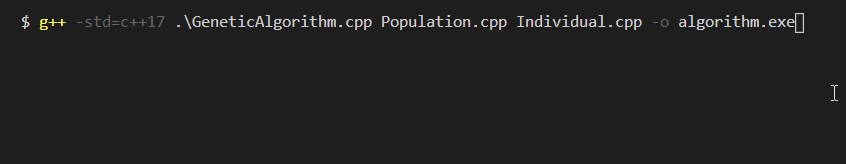
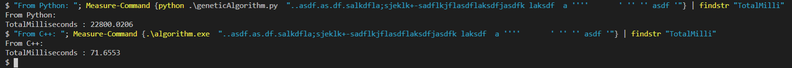

# Genetic Algorithm
#### Using the understanding from the Darwinian natural evolution and use the algorithm to run the algorith to reach a target 
### Python program to perform the Genetic Algorithm.

### C++ program to perform the Genetic Algorithm.

### Measuring and comparing the time for the C++ and Python
 